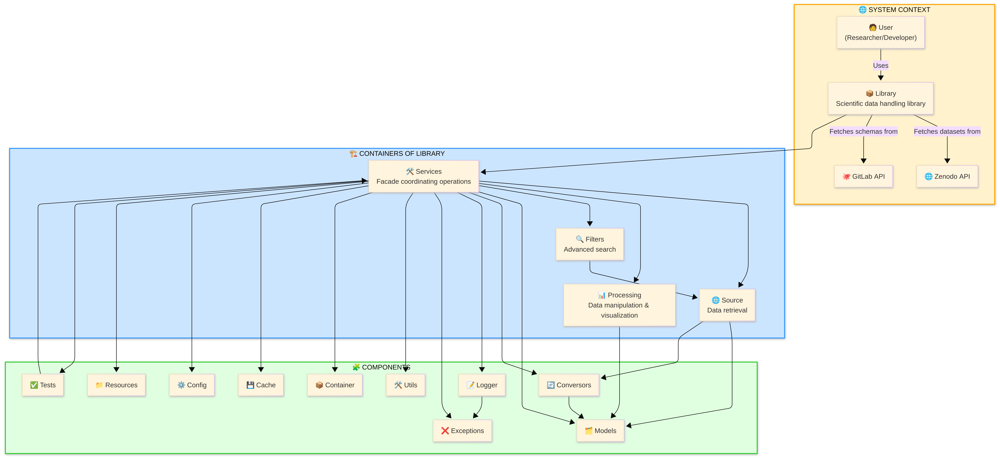

# HFLAV FAIR client

## Documentation

If you want to check the full documentation of this project, go to the docs folder.

The C4 architecture diagram can be checked in this picture:



And the class structure is as it can be seen in this image:


## Configuring environment variables

All the environment variables available can be seen in the `EnvironmentVariables` enum inside the [config](hflav_fair_client/config.py) file

If you want to use it in your code you should add these lines before anything:

```python
from dotenv import load_dotenv

load_dotenv()
```