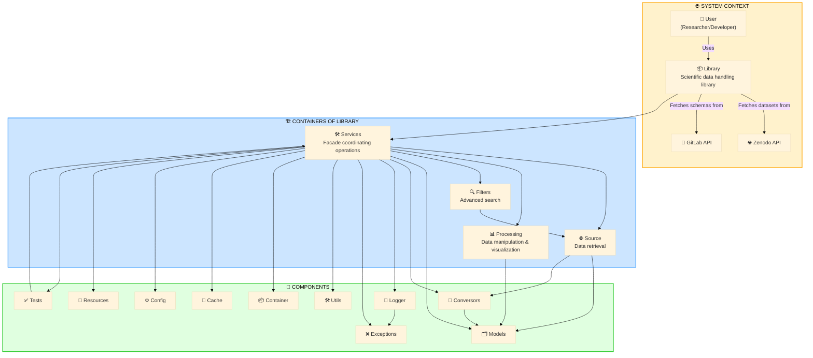

```mermaid
%%{init: {"theme": "base"}}%%
graph TD
    %% ===== Level 1: Context =====
    subgraph Context["🌐 SYSTEM CONTEXT"]
        user["🧑 User<br>(Researcher/Developer)"]
        zenodo["🌐 Zenodo API"]
        gitlab["🐙 GitLab API"]
        library["📦 Library<br>Scientific data handling library"]
    end

    %% Context relationships
    user -->|Uses| library
    library -->|Fetches datasets from| zenodo
    library -->|Fetches schemas from| gitlab

    %% ===== Level 2: Containers =====
    subgraph Containers["🏗️ CONTAINERS OF LIBRARY"]
        services["🛠️ Services<br>Facade coordinating operations"]
        source["🌐 Source<br>Data retrieval"]
        processing["📊 Processing<br>Data manipulation & visualization"]
        filters["🔍 Filters<br>Advanced search"]
    end

    %% Container relationships
    library --> services
    services --> source
    services --> processing
    services --> filters

    %% ===== Level 3: Components =====
    subgraph Components["🧩 COMPONENTS"]
        models["🗂️ Models"]
        conversors["🔄 Conversors"]
        logger["📝 Logger"]
        exceptions["❌ Exceptions"]
        utils["🛠️ Utils"]
        container["📦 Container"]
        cache["💾 Cache"]
        config["⚙️ Config"]
        resources["📁 Resources"]
        tests["✅ Tests"]
    end

    %% Component relationships
    services --> models
    services --> conversors
    services --> logger
    services --> exceptions
    services --> utils
    services --> container
    services --> cache
    services --> config
    services --> resources
    services --> tests

    source --> models
    source --> conversors
    conversors --> models
    processing --> models
    filters --> source
    logger --> exceptions
    tests --> services

    %% ===== Styles =====
    style Context fill:#FFF2CC,stroke:#FFA500,stroke-width:2px
    style Containers fill:#CCE5FF,stroke:#3399FF,stroke-width:2px
    style Components fill:#E0FFE0,stroke:#33CC33,stroke-width:2px
```