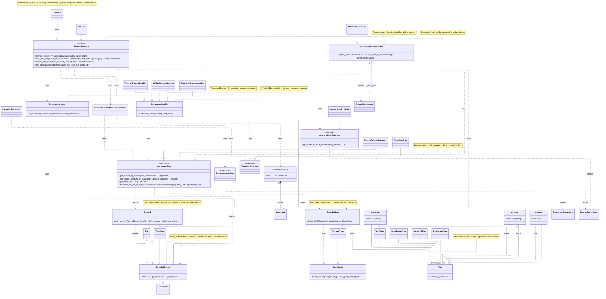

```mermaid
---
config:
  layout: elk
---
classDiagram
    class ServiceInterface {
        <<interface>>
        +search_records_by_name(query: BaseQuery) List[Record]
        +load_data_file(record_id: int, filename: Optional[str], dest_path: Optional[str]) SimpleNamespace
        +search_and_load_data_file(query: BaseQuery) SimpleNamespace
        +plot_data(data: SimpleNamespace, plot_type, plot_data) str
    }

    note for ServiceInterface "Facade pattern: Service simplifies all the process"

    class SourceInterface {
        <<interface>>
        +get_records_by_name(query: BaseQuery) List[Record]
        +get_correct_template_by_date(date: Optional[datetime]) Template
        +get_record(recid: int) Record
        +download_file_by_id_and_filename(id: int, filename: Optional[str], dest_path: Optional[str]) str
    }

    note for SourceInterface "Strategy pattern: It allows extend the source of the data"

    class ConversorInterface { <<interface>> }
    class VisualizerInterface { <<interface>> }
    class source_gitlab_interface {
        <<interface>>
        +get_schema_inside_repository(tag_version) dict
    }
    class Service
    class SourceZenodoRequests
    class source_gitlab_client
    class DynamicConversor
    class DataVisualizer
    class Container
    note for Container "External library that allows apply: Dependency Injection, Singleton pattern, Factory pattern"
    class BaseModel
    class ZenodoElement { +name: str +get_data() dict +is_leaf() bool }
    note for ZenodoElement "Composite Pattern: Record can contain multiple ZenodoElements"
    class Record { +children: List[ZenodoElement] +add_child() +remove_child() +get_child() }
    note for Record "Composite Pattern: Record can contain multiple ZenodoElements"
    class File
    class Template
    class CommandInvoker { +set_command() +execute_command() +undo_command() }
    note for CommandInvoker "Command Pattern: Encapsulate requests as objects"
    class Command
    class SearchAndLoadDataFileCommand
    class CommandHistory { +history: List[Command] }
    class ConversorHandler { <<abstract>> +handle() +can_handle() +set_next() }
    note for ConversorHandler "Chain of Responsibility: Dynamic conversor selection"
    class ZenodoSchemaHandler
    class GitlabSchemaHandler
    class TemplateSchemaHandler
    class BaseQuery { +build_params() Dict[str, Any] +build_query_string() str }
    note for BaseQuery "Interpreter Pattern: Build complex queries from filters"
    class ZenodoQuery
    class QueryBuilder { +filters: List[Filter] +add_filter() +build() BaseQuery }
    note for QueryBuilder "Interpreter Pattern: Build complex queries from filters"
    class Filter { <<abstract>> +build_query() str }
    class TextFilter
    class DateRangeFilter
    class NumericFilter
    class ExistenceFilter
    class AndFilter { +filters: List[Filter] }
    class OrFilter { +filters: List[Filter] }
    class NotFilter { +filter: Filter }
    class SimpleNamespace
    class BaseHflavDataDecorator { +_hflav_data: SimpleNamespace +get_data_as_namespace() SimpleNamespace }
    note for BaseHflavDataDecorator "Decorator Pattern: Add functionality to data objects"
    class HflavDataSearching
    class ConversorExceptions
    class SourceExceptions
    Service --|> ServiceInterface
    SourceZenodoRequests --|> SourceInterface
    source_gitlab_client --|> source_gitlab_interface
    DataVisualizer --|> VisualizerInterface

    ZenodoElement --|> BaseModel
    Record --|> ZenodoElement
    File --|> ZenodoElement
    Template --|> ZenodoElement

    SearchAndLoadDataFileCommand --|> Command

    ZenodoSchemaHandler --|> ConversorHandler
    GitlabSchemaHandler --|> ConversorHandler
    TemplateSchemaHandler --|> ConversorHandler

    ZenodoQuery --|> BaseQuery

    TextFilter --|> Filter
    DateRangeFilter --|> Filter
    NumericFilter --|> Filter
    ExistenceFilter --|> Filter
    AndFilter --|> Filter
    OrFilter --|> Filter
    NotFilter --|> Filter

    HflavDataSearching --|> BaseHflavDataDecorator
    Record "1" o-- "*" ZenodoElement : children
    CommandHistory "1" *-- "*" Command : history
    QueryBuilder "1" o-- "*" Filter : filters
    BaseHflavDataDecorator "1" o-- "1" SimpleNamespace : _hflav_data
    AndFilter "1" o-- "*" Filter : filters
    OrFilter "1" o-- "*" Filter : filters
    NotFilter "1" o-- "1" Filter : filter
    ServiceInterface ..> SourceInterface : uses
    SourceInterface ..> QueryBuilder : uses
    QueryBuilder ..> BaseQuery : uses
    ServiceInterface ..> SimpleNamespace : returns
    ServiceInterface ..> CommandInvoker : uses
    ServiceInterface ..> ConversorHandler : uses
    ServiceInterface ..> QueryBuilder : uses
    ServiceInterface ..> SearchAndLoadDataFileCommand : uses

    CommandInvoker ..> Command : uses
    CommandInvoker ..> CommandHistory : uses
    SearchAndLoadDataFileCommand ..> SourceInterface : uses

    ConversorHandler ..> SourceInterface : uses
    ConversorHandler ..> VisualizerInterface : uses
    ConversorHandler ..> ConversorInterface : uses
    GitlabSchemaHandler ..> source_gitlab_interface : uses

    SourceInterface ..> ZenodoElement : returns
    SourceInterface ..> Record : returns
    SourceInterface ..> SourceExceptions : throws
    source_gitlab_interface ..> SourceExceptions : throws
    ConversorInterface ..> ConversorExceptions : throws

    Container ..> ServiceInterface : uses
    DynamicConversor ..> VisualizerInterface : uses
```